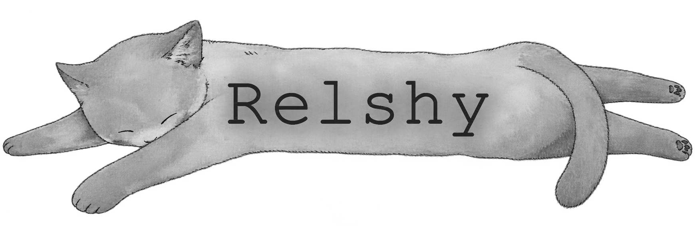

<picture><source media="(prefers-color-scheme: dark)" srcset="assets/banner-dark.png"></picture>

### hi, i'm relshy

i just be making shi mostly stuff like offensive security or automation tools

<picture><source media="(prefers-color-scheme: dark)" srcset="assets/rule-dark.svg"></picture>

<picture><source media="(prefers-color-scheme: dark)" srcset="assets/label-languages-dark.svg"></picture>     

<picture><source media="(prefers-color-scheme: dark)" srcset="assets/label-tools-dark.svg"></picture>     

<picture><source media="(prefers-color-scheme: dark)" srcset="assets/rule-dark.svg"></picture>

**Roblox / Luau Developer** ❯ *building systems and gameplay tooling* 
**Offensive Security & Malware Analysis** ❯ *currently in school for cybersecurity though :p*

**currently working on** ❯ *a Luau framework*

<picture><source media="(prefers-color-scheme: dark)" srcset="assets/rule-dark.svg"></picture>

  
